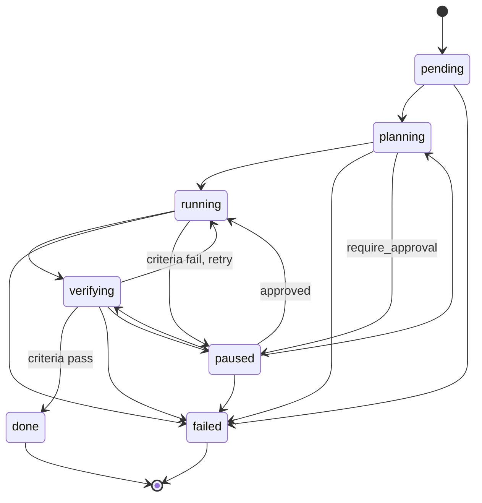
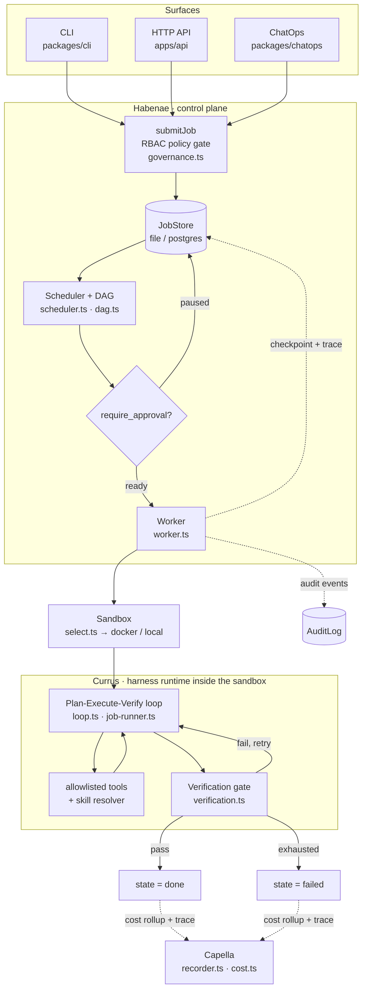

# Architecture

Auriga is a **harness job platform** for agents: an agent-flavored job scheduler / control plane that
makes a single agent **job** a first-class citizen. This document explains how the system fits together —
the thesis, the components, the job lifecycle, the request flow, and the seams that make every external
dependency swappable.

> New here? Read this top-to-bottom once, then keep [the CLI manual](./cli.md) and
> [the API/ChatOps reference](./api.md) next to you.

## Thesis

**`Agent = Model + Harness`.** Auriga self-builds the *harness* — the agent loop, context engineering, the
job model, the control plane, verification, and the skill resolver. Everything else (database, queue,
sandbox isolation, telemetry, model SDKs) is proven infrastructure glued in behind interfaces. **No
agent-orchestration framework owns the control flow.**

## Component codenames

| Codename | Package | Role |
|---|---|---|
| **Currus** ("chariot") | [`packages/currus`](../packages/currus) | Harness runtime — the Plan-Execute-Verify loop that runs inside the sandbox |
| **Habenae** ("the reins") | [`packages/habenae`](../packages/habenae) | Control plane — persistence, queue, scheduler, worker, RBAC, audit, dashboard |
| **Capella** (brightest star of Auriga) | [`packages/capella`](../packages/capella) | Observability — cost rollups, OpenTelemetry spans, trace formatting |
| **factio** / **Factiones** | *(domain concept)* | Unit of tenancy / agent pool; every job carries a `factio` |

## Package map

10 packages + 2 apps (Bun workspaces, all TypeScript):

| Package | Responsibility |
|---|---|
| [`@auriga/core`](../packages/core) | Shared types & Zod schemas — job model, lifecycle, skill contract, provider seam, trace model. Schemas are the source of truth; types are inferred. |
| [`@auriga/provider`](../packages/provider) | Model-provider seam + the Anthropic implementation, a deterministic stub, and model routing (the "reasoning sandwich"). |
| [`@auriga/sandbox`](../packages/sandbox) | The `Sandbox` abstraction + a Docker driver (real isolation) and a Local driver (dev fallback). |
| [`@auriga/currus`](../packages/currus) | The harness runtime: the PEV loop, tool dispatch (allowlisted), context compaction, the verification gate, and the skill resolver. |
| [`@auriga/skill-registry`](../packages/skill-registry) | Interim content-addressed + ed25519-signed skill artifact store and marketplace ranking. |
| [`@auriga/habenae`](../packages/habenae) | The control plane (see Capella/Currus split above): stores, queue, `Scheduler`, `Worker`, the RBAC `Policy` gate, the append-only audit log, and the dashboard. |
| [`@auriga/capella`](../packages/capella) | Cost accounting, trace recording/formatting, OTel spans. |
| [`@auriga/evals`](../packages/evals) | Deterministic trace replay (`ReplayProvider`) + an eval runner that scores recorded traces against acceptance criteria — no live model calls. |
| [`@auriga/cli`](../packages/cli) | The `auriga` command-line surface (file-backed). See [cli.md](./cli.md). |
| [`@auriga/chatops`](../packages/chatops) | Platform-agnostic chat command parser + handler + a Slack signature-verifying adapter. See [api.md](./api.md). |
| [`apps/api`](../apps/api) | A Hono HTTP API over the control plane + a minimal served console. See [api.md](./api.md). |
| [`apps/console`](../apps/console) | The **primary web surface** — a Next.js + Tailwind 4 + shadcn/ui console with a live (SSE) run timeline (deploys to Vercel). |

The CLI, HTTP API, ChatOps, and console are all thin **surfaces** over the same control plane (Habenae),
so RBAC, tenancy, and governance are enforced once and shared.

## Job lifecycle

A job's state machine is defined in [`packages/core/src/job/lifecycle.ts`](../packages/core/src/job/lifecycle.ts)
(`JOB_STATES`, `canTransition`). `done` and `failed` are terminal; `verifying` loops back to `running`
when the verification gate fails and the loop retries.

## Request flow

How a job travels from submission to a terminal state. Every governed step writes to the audit log.

**Step by step:**

1. **Submit** — a surface validates the spec (`parseJobSpec`, [`core/src/job/spec.ts`](../packages/core/src/job/spec.ts))
   and calls `submitJob` ([`habenae/src/governance.ts`](../packages/habenae/src/governance.ts)). The RBAC
   gate checks the actor's factio + role, that `allowed_tools`/`required_skills` are permitted, and that
   `depends_on` ids belong to the same tenant. On success a `JobRecord` is created (`pending`) and a
   `job.created` audit event is written; a `PolicyError` becomes a `403`/denied reply.
2. **Schedule** — the `Scheduler` ([`habenae/src/scheduler.ts`](../packages/habenae/src/scheduler.ts))
   drains pending jobs respecting global + per-factio concurrency quotas and the dependency DAG
   ([`dag.ts`](../packages/habenae/src/dag.ts)). Jobs blocked by a failed/missing dependency are failed;
   failed jobs are retried with backoff when a retry policy is set.
3. **HITL gate** — if `require_approval` is set and the job isn't approved, the `Worker` pauses it
   (`paused`) before any sandbox is created. Approval (`auriga approve` / `POST /jobs/:id/approve`) flips
   `approved` and the job can run.
4. **Worker + sandbox** — the `Worker` ([`habenae/src/worker.ts`](../packages/habenae/src/worker.ts))
   selects a model route and a sandbox driver ([`sandbox/src/select.ts`](../packages/sandbox/src/select.ts):
   Docker preferred, Local as a dev fallback) and seeds the workspace (git clone / dir copy / snapshot
   restore) with CPU/memory/network limits.
5. **Plan-Execute-Verify loop** — inside the sandbox, Currus
   ([`currus/src/loop.ts`](../packages/currus/src/loop.ts),
   [`job-runner.ts`](../packages/currus/src/job-runner.ts)) plans with the model, dispatches **allowlisted**
   tool calls to the sandbox, resolves/verifies/mounts skills on demand, then runs the verification gate
   ([`verification.ts`](../packages/currus/src/verification.ts)) over the acceptance criteria. Pass →
   `done`; fail with attempts left → `running` (retry); otherwise → `failed`. Stop conditions: model
   `end_turn`, `max_steps`, or budget exhaustion.
6. **Checkpoint & resume** — after each attempt the Worker persists a checkpoint (transcript, usage,
   step cursor, loaded skills, workspace snapshot). A fresh worker can restore and resume deterministically
   after a crash.
7. **Trace, cost & audit** — every model call, tool call, skill load, compaction, and verify is recorded
   as a structured trace ([`core/src/trace/types.ts`](../packages/core/src/trace/types.ts)); Capella rolls
   tokens up to USD and can emit OTel spans; the append-only audit log records each governed action.

## The swappable seams

The design principle is one interface per external concern, with a real driver and a test/dev driver, so
the engine is testable hermetically and adaptable in production. **Self-built** seams own control flow;
**glued** seams wrap proven infrastructure.

| Seam (interface) | Defined in | Drivers | Kind |
|---|---|---|---|
| `JobStore` | [`habenae/src/types.ts`](../packages/habenae/src/types.ts) | `InMemoryJobStore`, `FileJobStore`, `PostgresJobStore` | glued (Postgres) |
| `Queue` | [`habenae/src/types.ts`](../packages/habenae/src/types.ts) | `InProcessQueue`, `GraphileQueue` (graphile-worker) | glued |
| `Sandbox` / `SandboxDriver` | [`sandbox/src/types.ts`](../packages/sandbox/src/types.ts) | `LocalSandboxDriver`, `DockerSandboxDriver` | glued (never self-built isolation) |
| `ModelProvider` | [`core/src/provider/types.ts`](../packages/core/src/provider/types.ts) | `AnthropicProvider`, `StubProvider`, `ReplayProvider` | glued (SDK) |
| `SkillRegistry` | [`core/src/skill/types.ts`](../packages/core/src/skill/types.ts) | `LocalSkillRegistry` (`openDevRegistry`) | self-built (interim) |
| `AuditLog` | [`habenae/src/audit.ts`](../packages/habenae/src/audit.ts) | `InMemoryAuditLog`, `FileAuditLog`, `PostgresAuditLog` | self-built |
| `Policy` | [`habenae/src/governance.ts`](../packages/habenae/src/governance.ts) | `InMemoryPolicy`, `StoreBackedPolicy` | self-built |
| `EventBus` | [`habenae/src/event-bus.ts`](../packages/habenae/src/event-bus.ts) | `InMemoryEventBus`, `PostgresEventBus` (LISTEN/NOTIFY) | self-built |

The hermetic default test gate uses the in-memory/file/local/stub drivers; the live Postgres + Docker +
graphile drivers are exercised by the CI `integration` job (see [CONTRIBUTING](../CONTRIBUTING.md)).

### Live run events

`Worker` optionally publishes to an [`EventBus`](../packages/habenae/src/event-bus.ts) as a run unfolds:
lifecycle `state` transitions, each `TraceEvent` (teed from the `Recorder`, so the sealed trace is
unchanged), `progress` (attempt/steps/usage + live cost), and a terminal `done`. Each event is wrapped in
a `JobEventEnvelope` with a per-job monotonic `seq`. The HTTP API exposes them over SSE at
`GET /jobs/:id/events` (backfill-then-tail via `Last-Event-ID`); the Next.js console renders them as a live
step timeline (see [api.md](./api.md)). `InMemoryEventBus` serves the in-process dev/test path;
`PostgresEventBus` (a durable `job_events` log + `LISTEN/NOTIFY`, selected via `selectEventBus`) bridges the
production cross-process (graphile-worker) path with the same `seq` semantics.

## Domain model

The contracts a developer must understand live in [`@auriga/core`](../packages/core):

- **`JobSpec`** ([`job/spec.ts`](../packages/core/src/job/spec.ts)) — the unit of scheduling and delivery:
  `id`, `factio`, `created_by`, `goal`, `context_refs` (a git/dir workspace + optional files/links),
  `allowed_tools` (code-level allowlist enforced in the dispatcher), optional `allowed_skills` /
  `required_skills`, `acceptance_criteria` (≥1), `budget`, optional `require_approval` (HITL), and optional
  `depends_on` (DAG).
- **Acceptance criteria** — a discriminated union: `command` (run a shell command, assert `expect_exit`),
  `file_exists` (a path must exist), or `named_check` (a pluggable verifier). The verification gate must
  pass all of them before `done`.
- **`Budget`** — hard caps the harness/scheduler enforce: `max_tokens`, `max_wall_time_s`, `max_cost_usd`,
  `max_steps`.
- **`JobRecord`** ([`habenae/src/types.ts`](../packages/habenae/src/types.ts)) — the persisted job: spec +
  `state`, `reason`, `model`, `approved`, `attempts`, `steps`, `usage`, `loaded_skills`, timestamps.
- **Skill contract** — see the dedicated spec at
  [`packages/core/src/skill/README.md`](../packages/core/src/skill/README.md) (progressive disclosure,
  content-addressing, ed25519 signing, RBAC-filtered resolution).
- **Provider seam** ([`core/src/provider/types.ts`](../packages/core/src/provider/types.ts)) — `Message`,
  `ContentBlock`, `GenerateRequest`, `ModelResponse`, `ToolDefinition`, and the `ModelProvider` interface.
- **Trace model** ([`core/src/trace/types.ts`](../packages/core/src/trace/types.ts)) — an ordered list of
  `model_response | tool_call | skill_loaded | compaction | verify` events; the substrate for
  observability, cost, replay, and evals. The same file defines **`JobLiveEvent`** /
  **`JobEventEnvelope`** — the incremental, sequenced events streamed live while a run is in flight (the
  `EventBus` seam), reusing the `TraceEvent` union so live and sealed views share one renderer.
